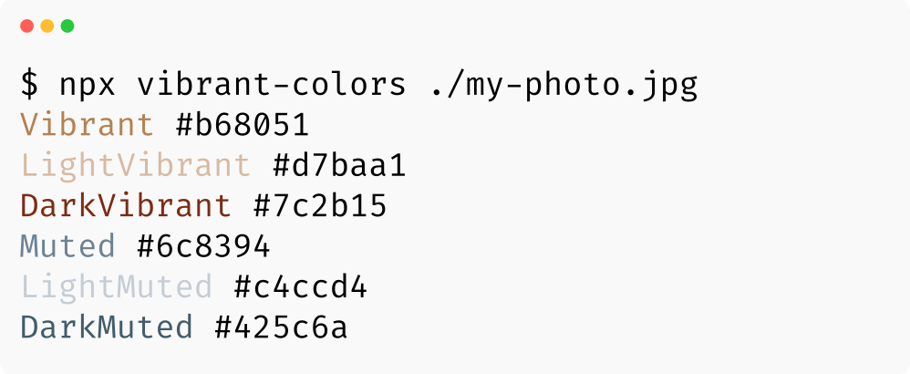

# Vibrant Colors

A CLI for getting vibrant colors from an image using node-vibrant.



## Usage

```bash
# install it globally
npm i -g vibrant-colors
vibrant-colors my-photo.jpg

# or try it with npx
npx vibrant-colors my-photo.jpg
```

## Options

See `vibrant-colors --help`:

```
Usage: index [options] <file>

Options:
  -V, --version          output the version number
  -q, --quality <n>      Quality: Scale down factor used in downsampling stage. 1 means no downsampling.
                         If maxDimension is set, this value will not be used. Default: 5.
  -c, --color-count <n>  Color count: amount of colors in initial palette from which the swatches will be generated. Default: 64
  -h, --help             output usage information
```
